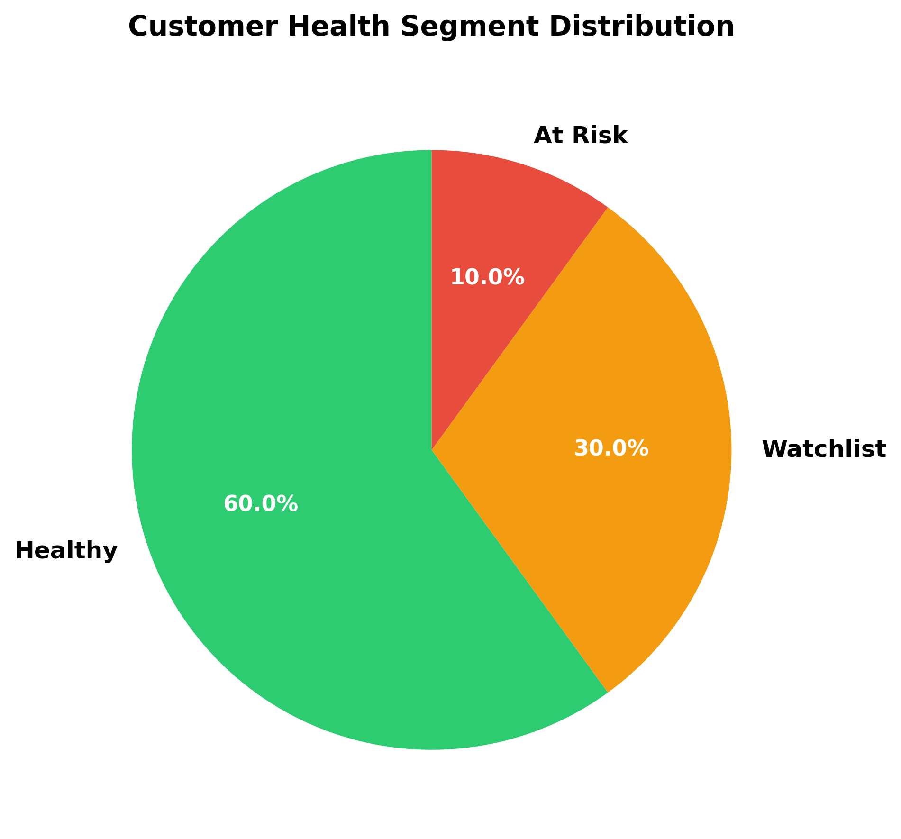
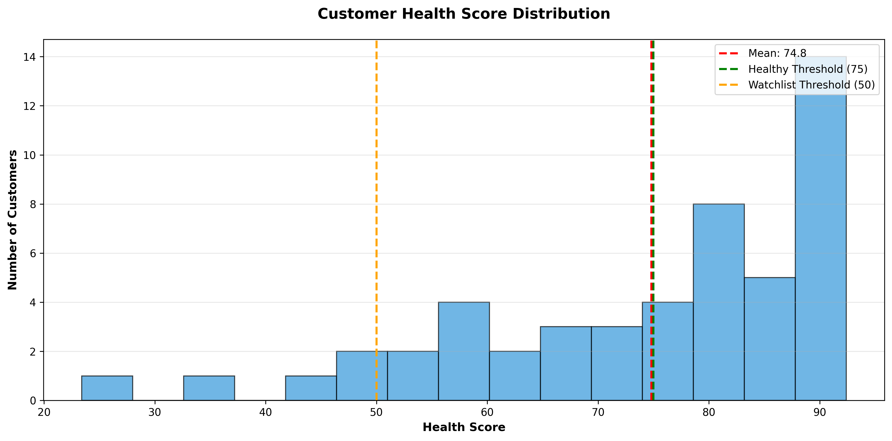
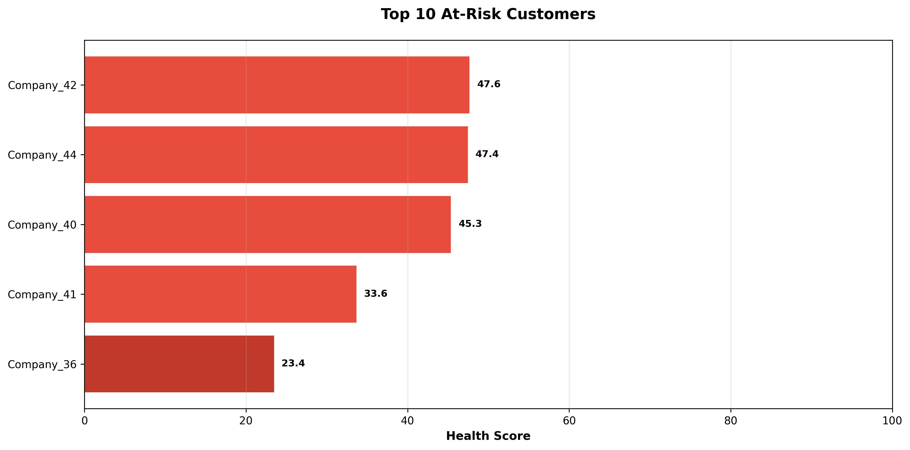
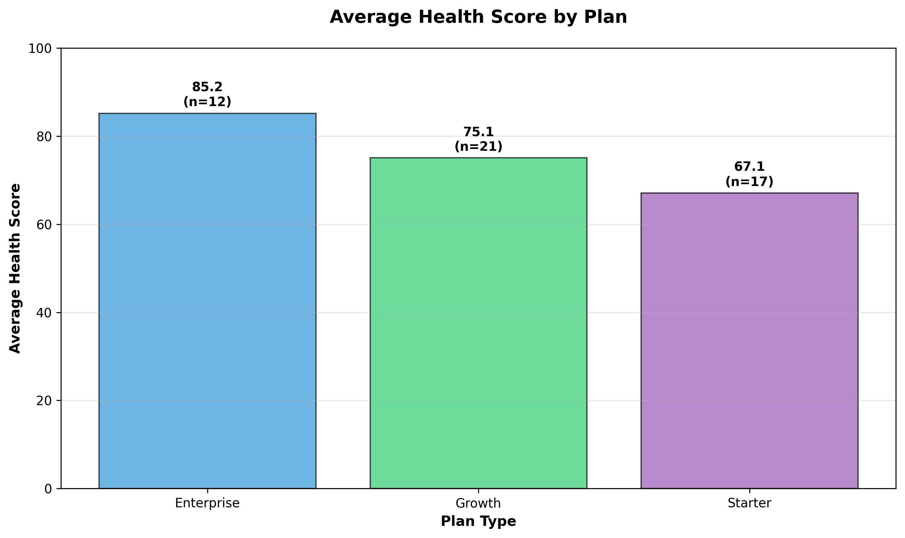

# Customer Health Score Engine

A data-driven system to identify churn risk and prioritize Customer Success actions across SaaS accounts.

Built to simulate how CS, RevOps, and Product teams can align around a single source of truth for customer health.

---

## 🧠 Problem

Customer Success teams often rely on fragmented data (product usage, support tickets, billing status) to assess account health. This makes it difficult to proactively identify churn risk and prioritize actions.

---

## ⚙️ Solution

This project builds a Customer Health Score Engine that consolidates usage, engagement, support, and commercial data into a single score to:

- Identify at-risk customers
- Prioritize intervention
- Support data-driven retention strategies

---

## 🏗️ How it works

1. Generate synthetic SaaS customer data
2. Load data into SQLite
3. Compute customer-level metrics using SQL
4. Calculate health scores using weighted logic
5. Generate visualizations and business insights

---

## 📊 Results

- 50 customers analyzed
- 5 customers identified as At Risk
- 165 support tickets analyzed
- Key churn drivers identified:
  - Low product usage
  - High volume of unresolved support tickets
  - Overdue payments

---

## Dataset Overview

The system analyzes **50 synthetic SaaS customers** across four dimensions:

| Dataset | Records | Metrics |
|---------|---------|---------|
| **Customers** | 50 | Plan, industry, contract value, renewal date |
| **Usage Events** | 5,324 | Logins, publishes, exports, integrations (6-month history) |
| **Support Tickets** | 165 | Priority, status, creation date |
| **Commercials** | 50 | Payment status, renewal stage, QBR date |

---

## Tech Stack

- **Python 3.9** — Data processing and scoring logic
- **pandas** — Data manipulation and CSV handling
- **SQLite** — Persistent data storage
- **SQL (with CTEs)** — Aggregation and metrics calculation
- **matplotlib** — Chart generation and visualization

---

## Project Workflow

### 1. **Generate Synthetic Data** (`generate_data.py`)
Creates stratified customer segments with realistic risk patterns:
- 15 Healthy customers (high usage, paid, on-track renewals)
- 20 Watchlist customers (moderate signals)
- 15 At-Risk customers (low usage, stale activity, overdue payments)

**Output:** `data/*.csv`

### 2. **Load Data into SQLite** (`load_data.py`)
- Executes schema creation (`sql/create_tables.sql`)
- Loads all CSV files into database tables
- Validates data integrity

**Output:** `customer_health.db`

### 3. **Calculate Customer Metrics** (`sql/customer_metrics.sql`)
Aggregates raw data using CTEs to prevent duplicate counts:
- **Usage metrics**: Total events, unique active users, days since last activity, event type breakdowns
- **Support metrics**: Total tickets, open tickets, high-priority count
- **Commercial metrics**: Days until renewal, payment status, renewal stage

**Output:** `outputs/customer_metrics.csv`

### 4. **Calculate Health Scores** (`calculate_health_scores.py`)
Computes weighted health scores for each customer:

```
Health Score = 
    (Usage Score × 0.40) +
    (Engagement Score × 0.25) +
    (Support Score × 0.20) +
    (Commercial Score × 0.15)
```

Segments customers:
- 🟢 **Healthy**: Score ≥ 75
- 🟡 **Watchlist**: Score 50–74
- 🔴 **At Risk**: Score < 50

**Output:** `outputs/customer_health_scores.csv`

### 5. **Generate Visualizations & Insights** (`analyze_health_scores.py`)
Creates executive-ready artifacts:
- 4 professional charts (PNG)
- Business insights summary (TXT)

**Output:** `outputs/charts/*.png`, `outputs/health_insights_summary.txt`

---

## Scoring Methodology

### **Usage Score** (40%)
Measures activity recency:
- **100**: Activity within 7 days (very active)
- **80**: Activity within 30 days (active)
- **50**: Activity within 60 days (moderate)
- **20**: Activity >60 days (inactive)

### **Engagement Score** (25%)
Based on unique active users and feature adoption:
- Unique users: up to 50 points
- Feature usage (publish + export + integration): up to 50 points
- **Capped at 100**

### **Support Score** (20%)
Ticket health:
- Start: 100 points
- Penalty: -15 per open ticket
- Penalty: -25 per high-priority ticket
- **Minimum: 0**

### **Commercial Score** (15%)
Payment and renewal health:
- **100**: Paid + on-track renewals (ideal)
- **70**: Unknown renewal stage (uncertain)
- **40**: Overdue OR at-risk (warning)
- **20**: Overdue AND at-risk (critical)

---

## Key Results

### Portfolio Health
- **Total Customers**: 50
- **Average Health Score**: 74.8 / 100
- **Score Range**: 23.4 – 92.4

### Health Segments
| Segment | Count | % | Action |
|---------|-------|---|----|
| 🟢 Healthy | 30 | 60% | Monitor quarterly |
| 🟡 Watchlist | 15 | 30% | Monthly check-ins |
| 🔴 At Risk | 5 | 10% | Immediate intervention |

### Support Metrics
- **Total Tickets**: 165
- **High-Priority**: 54
- **Open Tickets**: 97
- **Avg per Customer**: 3.3

### Top At-Risk Customers
1. **Company_36** (Score: 23.4) — 96 days inactive, overdue payment
2. **Company_41** (Score: 33.6) — High ticket volume, overdue payment
3. **Company_40** (Score: 45.3) — Renewal at risk, overdue payment
4. **Company_44** (Score: 47.4) — Uncertain renewal, overdue payment
5. **Company_42** (Score: 47.6) — 8 high-priority tickets, unknown renewal

---

## Visualizations

### Health Segment Distribution


### Health Score Distribution


### Top 10 At-Risk Customers


### Average Score by Plan


---

## 🎯 Recommended Actions

Based on customer health signals, the system can support Customer Success actions:

- 🔴 **At Risk + Low Usage**
  → Trigger re-engagement campaigns (training, onboarding refresh)

- 🔴 **At Risk + High Support Load**
  → Prioritize escalation and technical resolution

- 🟡 **Watchlist + Upcoming Renewal**
  → Schedule QBR and align on value realization

- 🟢 **Healthy + High Engagement**
  → Identify expansion opportunities (upsell/cross-sell)

This transforms the model from a monitoring tool into a decision-support system.

---

## How to Run Locally

### Prerequisites
- Python 3.9+
- `pip` or `conda`

### Setup

1. **Clone the repository**
```bash
git clone https://github.com/yourusername/customer-health-project.git
cd customer-health-project
```

2. **Create a virtual environment**
```bash
python3 -m venv .venv
source .venv/bin/activate
```

3. **Install dependencies**
```bash
pip install -r requirements.txt
```

### Run the Pipeline

Execute the full workflow in order:

```bash
# 1. Generate synthetic data
python3 generate_data.py

# 2. Load data into SQLite and calculate metrics
python3 load_data.py

# 3. Calculate health scores
python3 calculate_health_scores.py

# 4. Generate visualizations and insights
python3 analyze_health_scores.py
```

### Run the Interactive Dashboard

Launch the Streamlit web interface:

```bash
streamlit run app.py
```

The app will open at `http://localhost:8501` with:
- 📊 **Dashboard**: Key portfolio metrics and visualizations
- 🔍 **Customer Search**: Find and analyze individual customers
- 📈 **Detailed Analysis**: Deep dive into portfolio composition
- 💡 **Recommendations**: Actionable insights by health segment

### Outputs

After running, check these files:
- `outputs/customer_health_scores.csv` — Final scores and segments
- `outputs/health_insights_summary.txt` — Executive summary
- `outputs/charts/*.png` — Visualizations (4 charts)
- `customer_health.db` — SQLite database with all metrics

---

## Project Structure

```
customer-health-project/
├── README.md
├── generate_data.py              # Synthetic data generation
├── load_data.py                  # Data loading pipeline
├── calculate_health_scores.py    # Scoring engine
├── analyze_health_scores.py      # Visualization & insights
├── data/
│   ├── customers.csv
│   ├── usage_events.csv
│   ├── support_tickets.csv
│   └── commercials.csv
├── sql/
│   ├── create_tables.sql
│   └── customer_metrics.sql      # CTE-based aggregation query
├── outputs/
│   ├── customer_metrics.csv
│   ├── customer_health_scores.csv
│   ├── health_insights_summary.txt
│   └── charts/
│       ├── health_segment_distribution.png
│       ├── health_score_distribution.png
│       ├── top_10_at_risk_customers.png
│       └── average_score_by_plan.png
└── customer_health.db
```

---

## Key Features

✅ **Stratified Risk Segmentation** — Customers generated with realistic health patterns  
✅ **Multi-Dimensional Scoring** — Usage, engagement, support, and commercial signals  
✅ **Data Quality** — CTE-based SQL aggregation prevents duplicate counts  
✅ **Executive Dashboards** — Professional visualizations ready for stakeholders  
✅ **Actionable Insights** — Prioritized CS actions with business impact estimates  
✅ **Reproducible** — Deterministic synthetic data (seeded random generation)  
✅ **Scalable** — SQLite queries optimized with indexes; easily extends to real data

---

## Next Steps

This project demonstrates a production-ready customer health framework. Extend it by:

1. **Connecting real data**: Replace CSV generation with live API/database connections
2. **Custom thresholds**: Adjust scoring weights for your SaaS business model
3. **Automated alerts**: Schedule pipeline runs and send alerts on score changes
4. **Dashboard integration**: Export to Looker, Tableau, or internal analytics platform
5. **Predictive modeling**: Train churn prediction models on health scores

---

## License

MIT

---

## Author

Built as a comprehensive Customer Success analytics reference project.

**Generated**: April 2026
